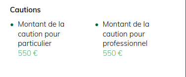
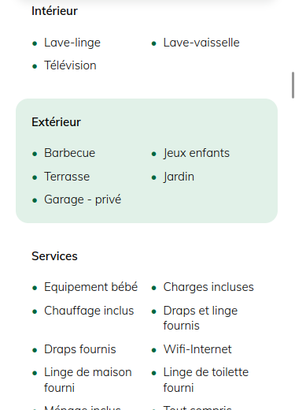

## Exercie intégration

Il s'agit d'un exercice visant à découvrir le HTML (**H**yper**T**ext **M**arkup **L**anguage) et le CSS (**C**ascading **S**tyle **S**heets), qui sont les langages permettant de créer l'interface d'une page Web. 

On verra à travers un exemple comment apporter des améliorations, des corrections ou des nouvelles fonctionnalités à un projet web statique. 

--------------------

On va voir comment cibler des éléments de la page via un sélecteur css, et rendre un élément ciblable si le html existant ne suffit pas. 

Une fois les sélecteurs compris, on va pouvoir appliquer du style via le fichier contenu dans `src/styles/index.css`. 

On déclare le sélecteur et on applique le style. 

#### Exercice 1: 

On va essayer de se rapprocher de la page de base : 

on a 4 étapes : 

* mettre en gras le `Cautions`
* changer l'alignement de la liste (balise `ul`)
* Changer la couleur de la puce `#00653f`
* mettre le prix à la ligne et en couleur verte (le vert : `#4bab77
`)

#### Exercice 2

Maintenant on continue de travailler sur les lises: dans la section Equipements

comme avant : 

* styliser la puce
* changer le positionnement
* changer le background