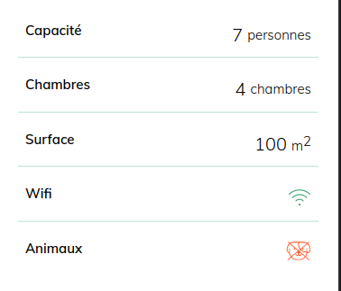

## Exercie intégration

Il s'agit d'un exercice visant à découvrir le HTML (**H**yper**T**ext **M**arkup **L**anguage) et le CSS (**C**ascading **S**tyle **S**heets), qui sont les langages permettant de créer l'interface d'une page Web. 

On verra à travers un exemple comment apporter des améliorations, des corrections ou des nouvelles fonctionnalités à un projet web statique. 

------------------------------

Maintenant on va essayer de résoudre des bugs dans la page. 

* le logo ne s'affiche plus
* Il y a une ligne soulignée en trop par rapport à la version de base: 